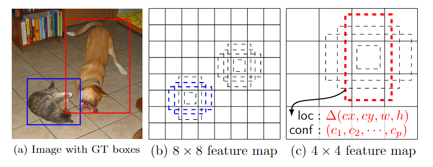
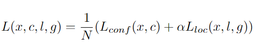
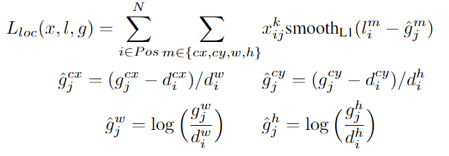

### 摘要

* 将检测过程整合成一个 single deep neural network。便于训练与优化，同时提高检测速度。
* SSD 将输出一系列离散化（discretization） 的 bounding boxes，这些 bounding boxes 是在 不同层次（layers） 上的 feature maps 上生成的，并且有着不同的 aspect ratio。
* 在 prediction 阶段：
    * 计算出每一个 default box 中的物体，其属于每个类别的可能性，如对于 PASCAL VOC 数据集，总共有 20 类，那么得出每一个 bounding box 中物体属于这 20 个类别的每一种的可能性。
    * 对这些 bounding boxes 的 shape 进行微调，以使得其符合物体的 外接矩形。
    * 为了处理相同物体的不同尺寸的情况，SSD 结合了不同分辨率的 feature maps 的 prediction
    
### 1. Introduction


### 2. The Single Shot Detector (SSD) 

#### default box 以及 feature map cell

* feature map cell 就是将 feature map 切分成  或者  之后的一个个 格子；
* default box 就是每一个格子上，一系列固定大小的 box，即图中虚线所形成的一系列 boxes。




#### Model

> SSD是基于一个前向传播CNN网络，产生一系列固定大小的bounding boxes，以及每一个box中包含物体实例的可能性，即 score。
之后，进行一个非极大值抑制得到最终的 predictions。

* SSD模型：VGG+额外辅助的网络：
    * Multi-scale feature maps for detection \
    多尺度网络融合特征
    
    * Convolutional predictors for detection \
    每一层都进行目标检测
    
    * Default boxes and aspect ratios \
        * 对于给定位置计算k个框
        * 对于每个框
            * c类
            * 4个偏移量
        * m*n的特征图计算量 （c+4）*k*m*n
    
    



#### Training

> SSD与其它网络关键区别：ground true需要与特殊的输出匹配

* 一些关键问题：
    * 选择一系列 default boxes
    * 选择上文中提到的 scales 的问题
    * hard negative mining
    * 数据增广的策略


##### 1. Matching strategy：

如何将groundtruth boxes与default boxes进行配对，以组成 label 呢？ 
* 我们选择default box来自不同坐标、不同尺寸、不同ratio，匹配ground truth
* 在开始的时候，用MultiBox中的best jaccard overlap来匹配每一个ground truth box与default box，这样就能保证每一个groundtruth box 与唯一的一个 default box 对应起来。
* 但是又不同于MultiBox ，本文之后又将default box 与任何的 groundtruth box 配对，只要两者之间的 jaccard overlap 大于一个阈值，这里本文的阈值为 0.5。 

##### 2. Training objective：

* SSD训练的目标函数源自于 MultiBox 的目标函数，但是本文将其拓展，使其可以处理多个目标类别。
* loss定义： 分类置信+定位 \
   

* 定位：某一类的每一个groundtrue与所有的default box中属于该类的box的位移偏差和 \
  
* 某一类的置信度（c）的softmax loss （*没看懂*）\
 


##### 3. Choosing scales and aspect ratios for default boxes

* 使用低层和高层的特征图做检测
* 定义default box为每一层, m表示特征图的数目，计算每个box的width和height，
    * 每个点产生6个box      
        * 1， 2， 3， 1/2, 1/3， 然后对于1的sk变化了，根据公式也会产生一个 
    
   

##### 4. Hard negative mining

* 根据highest confidence loss,排序，挑选最高的
* negative ：positive = 3：1

##### 5. Data augmentation


### 3. Experimental Results 




### reference 

* [论文阅读：SSD: Single Shot MultiBox Detector](http://blog.csdn.net/u010167269/article/details/52563573)

