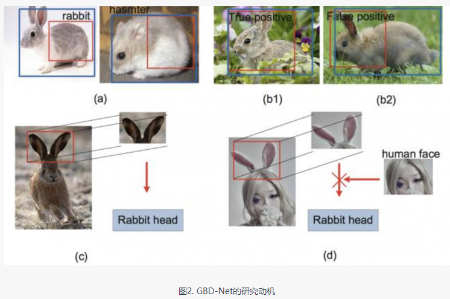
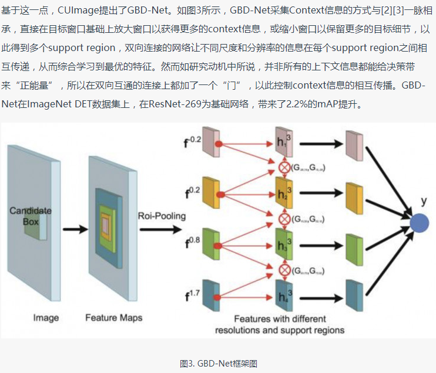

## 整体框架

* 目标检测近年来已经取得了很重要的进展，主流的算法主要分为两个类型：
   
    1. two-stage方法，如R-CNN系算法，其主要思路是先通过启发式方法（selective search）
    或者CNN网络（RPN)产生一系列稀疏的候选框，然后对这些候选框进行分类与回归，two-stage方法的优势是准确度高；
   
    2. one-stage方法，如Yolo和SSD，其主要思路是均匀地在图片的不同位置进行密集抽样，
    抽样时可以采用不同尺度和长宽比，然后利用CNN提取特征后直接进行分类与回归，整个过程只需要一步，所以其优势是速度快，
    但是均匀的密集采样的一个重要缺点是训练比较困难，这主要是因为正样本与负样本（背景）
    极其不均衡（参见Focal Loss，https://arxiv.org/abs/1708.02002），导致模型准确度稍低。


### one-stage方法
* YOLO
* [SSD](SSD%20Single%20shot%20multibox%20detector/ssd.md)


### two-stage方法
* RCNN -> SPPNET -> Fast-RCNN -> Faster-RCNN。
    * [RCNN- 将CNN引入目标检测的开山之作](https://zhuanlan.zhihu.com/p/23006190?refer=xiaoleimlnote)
    * [推荐框选择算法](paper/2013-Selective%20Search%20for%20Object%20Recognition.pdf)
    * [Fast R-CNN](https://zhuanlan.zhihu.com/p/24780395?refer=xiaoleimlnote)
    * [Faster R-CNN](faster_rcnn.md)
* 综述类
    * [用于图像分割的卷积神经网络：从R-CNN到Mark R-CNN](http://mp.weixin.qq.com/s?__biz=MzA3MzI4MjgzMw==&mid=2650725842&idx=2&sn=e18500166c6108d7194588befba061a4&chksm=871b19acb06c90ba9c19ba73719d375c4fe1f378f9bccae82e508c34a20c7513c55a84d3441b&scene=21#wechat_redirect)
    * [干货 | 目标检测入门，看这篇就够了（上）](http://mp.weixin.qq.com/s?__biz=MzI0ODcxODk5OA==&mid=2247493997&idx=4&sn=c76274e177d490961963e5863ede7bb4&chksm=e99eda94dee953823014a21b2b66971835549b8bc3b376321080e545dd7ae3b19094014cc1a0&mpshare=1&scene=1&srcid=0319pOZYJwcrGmoH1WBJuQD9#rd)
    * [干货 | 目标检测入门，看这篇就够了（下）](http://mp.weixin.qq.com/s?__biz=MzI0ODcxODk5OA==&mid=2247494000&idx=2&sn=26a0dbce779b336c48e6dd51c1f05554&chksm=e99eda89dee9539fb842ccfef767139d331482ac78e99235258f8d57eee38c7d2a6bada73207&mpshare=1&scene=1&srcid=03197J0wiSRPFUFY3PuHgW04#rd)
### reference

* [Ross Girshick (rbg)](http://www.rossgirshick.info/)
* [如何评价rcnn、fast-rcnn和faster-rcnn这一系列方法？](https://www.zhihu.com/question/35887527)
* [“Deep Learning”------大总结](https://zhuanlan.zhihu.com/p/23203899)
* [目标检测实现的API](https://github.com/tryolabs/luminoth/blob/checkpoints/luminoth/models/fasterrcnn/fasterrcnn.py)



## 2016 进展

* 参赛队伍大多采用ResNet/Inception网络+Faster R-CNN框架，注重网络的预训练，改进RPN，并利用Context信息，
* 测试时结合普遍被使用的多尺度测试、水平翻转、窗口投票等方法，最终融合多个模型得到结果


* 下面我们将细数参赛方法中的诸多亮点

### 一、利用Context信息

1. GBD-Net（Gated Bi-Directional CNN）




2. Dilation as context

3. Global context

### 二、改进分类损失



### reference
* [ILSVRC2016目标检测任务回顾：图像目标检测](https://www.leiphone.com/news/201701/u3D5QnJbS9khm0VT.html)
