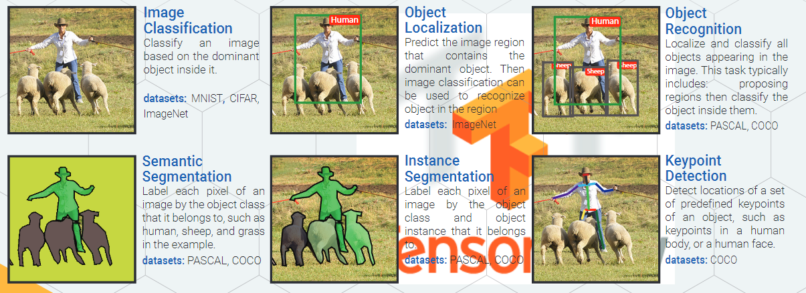

> ## [HistoryOfObjectRecognition](paper/HistoryOfObjectRecognition.pdf)
 
 
 
  




### 论文归纳



#### 第一类

* YOLO
* SSD



#### 第二类

* RCNN -> SPPNET -> Fast-RCNN -> Faster-RCNN。
    * [RCNN- 将CNN引入目标检测的开山之作](https://zhuanlan.zhihu.com/p/23006190?refer=xiaoleimlnote)
    * [推荐框选择算法](paper/2013-Selective%20Search%20for%20Object%20Recognition.pdf)
    * [Fast R-CNN](https://zhuanlan.zhihu.com/p/24780395?refer=xiaoleimlnote)
    * [Faster R-CNN](https://zhuanlan.zhihu.com/p/24916624?refer=xiaoleimlnote)
    * [SSD](https://zhuanlan.zhihu.com/p/24954433?refer=xiaoleimlnote)
    



### reference

* [Ross Girshick (rbg)](http://www.rossgirshick.info/)
* [如何评价rcnn、fast-rcnn和faster-rcnn这一系列方法？](https://www.zhihu.com/question/35887527)
* [“Deep Learning”------大总结](https://zhuanlan.zhihu.com/p/23203899)