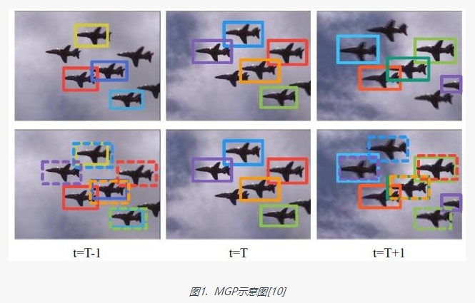
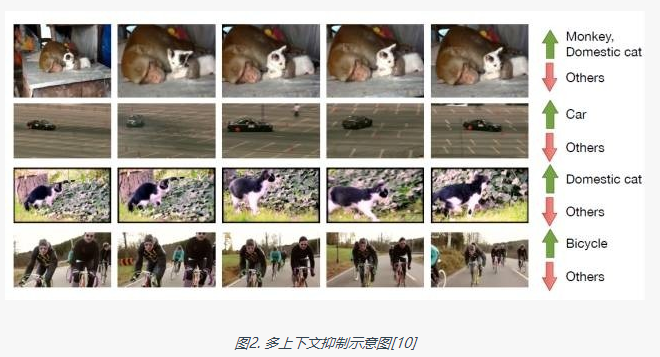

### 目前状况 2016

* 将视频帧视为独立的图像，利用图像目标检测算法获取检测结果
* 利用视频的时序信息和上下文信息对检测结果进行修正
* 基于高质量检测窗口的跟踪轨迹对检测结果进一步进行修正


#### 一、单帧图像目标检测

* 此阶段通常将视频拆分成相互独立的视频帧来处理， 通过选取优秀的图像目标检测框架以及各种提高图像检测精度的技巧来获取较为鲁棒的单帧检测结果
* [目标检测任务回顾：图像目标检测](https://www.leiphone.com/news/201701/u3D5QnJbS9khm0VT.html)

1. 训练数据选取
* 对ILSVRC2016 VID训练数据进行分析
    * VID数据库包含30个类别, 训练集共有3862个视频片段，总帧数超过112万
    * 同一个视频片段背景单一，相邻多帧的图像差异较小。所以要训练现有目标检测模型，VID训练集存在大量数据冗余，并且数据多样性较差，有必要对其进行扩充
    * 从ILSVRC DET和ILSVRC LOC数据中抽取包含VID类别的图片进行扩充
2. 网络结构选取
同样的训练数据，基于ResNet101的Faster R-CNN模型的检测精度比基于VGG16的Faster R-CNN模型的检测精度高12%左右


#### 二、改进分类损失

* 目标在某些视频帧上会存在运动模糊，分辨率较低，遮挡等问题，即便是目前最好的图像目标检算法也不能很好地检测目标。
* 视频中的时序信息和上下文信息能够帮助我们处理这类问题。比较有代表性的方法:
    * T-CNN中的运动指导传播（Motion-guided Propagation, MGP）
    * 多上下文抑制（Multi-context suppression, MCS）
* MGP（Motion-guided Propagation, MGP）
    * 单帧检测结果存在很多漏检目标，而相邻帧图像检测结果中可能包含这些漏检目标。
    * 可以借助光流信息将当前帧的检测结果前向后向传播，经过MGP处理可以提高目标的召回率。
    * 如图1所示将T时刻的检测窗口分别向前向后传播，可以很好地填补T-1和T+1时刻的漏检目标          
    
    
    
* MCS （Multi-context suppression, MCS）
    * 使用图像检测算法将视频帧当做独立的图像来处理并没有充分利用整个视频的上下文信息
    * 虽然说视频中可能出现任意类别的目标，但对于单个视频片段，只会出现比较少的几个类别
    * 而且这几个类别之间有共现关系（出现船只的视频段中可能会有鲸鱼，但基本不可能出现斑马）
    * 可以借助整个视频段上的检测结果进行统计分析：
        * 对所有检测窗口按得分排序，选出得分较高的类别，
        * 剩余那些得分较低的类别很可能是误检，需对其得分进行压制（如图2）。
    * 经过MCS处理后的检测结果中正确的类别靠前，错误的类别靠后，从而提升目标检测的精度。

    


#### 三、利用跟踪信息修正

* 上文提到的MGP可以填补某些视频帧上漏检的目标，但对于多帧连续漏检的目标不是很有效，而目标跟踪可以很好地解决这个问题
* 使用跟踪算法获取目标序列基本流程如下：
    * 使用图像目标检测算法获取较好的检测结果；
    * 从中选取检测得分最高的目标作为跟踪的起始锚点；
    * 基于选取的锚点向前向后在整个视频片段上进行跟踪，生成跟踪轨迹；
    * 从剩余目标中选择得分最高的进行跟踪，需要注意的是如果此窗口在之前的跟踪轨迹中出现过，那么直接跳过，选择下一个目标进行跟踪；
    * 算法迭代执行，可以使用得分阈值作为终止条件

### reference 

* [ILSVRC2016目标检测任务回顾——视频目标检测（VID](https://www.leiphone.com/news/201701/r6GB9fptnK3nDAdz.html)
